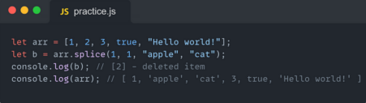

# Что такое Метод ?
...
## Метод это готовая фунция котора будет работать когда мы его вызовем !
...
# Что такое Array в JS ?
...
## Это лист или же object который принимает к себе любой тип значения то есть number , string , bool , masive и др которых можно вывести с помошью индексов !
...
## Так же мы можем поменять наш елемент в array с помошью его индекса вот пример на фото :   
...
# Вот виды методов в Array :   
...
## Метод Push :   С помошью этого Метода мы можем дробавить несколько элементов в нашем массиве но когда мы добавляем какой то элемент то он добавляется с конца нашего массива вот как на примере :    
... 
# Method Pop :   С помошью этого Метода мы можем удалять елементы с нашего массива но этот метод удаляет елементы с конца нашего массива вот как на примере :   
...
# Method Unshift :   С помошью этого метода мы можем добавлять в нутрь нашего массива несколко элементов и они будут добавлятся с переди массива вот как на примере :   
...
# Method Shift :   С помошью этого метода мы также можем удалять элементы с массива но только этот метод удаляет элементы с начала массива вот как на примере :   
... 
# Method toSrting :   Этот метод преврашает наш массив в String и всё вот как на примере :   
...
# Method indexOf :   С помошью этого метода мы можем находить индексы с помошью элемента в массиве вот как на примере :   
...
# Method includes :   Этот метод выполняет функцию поиска в нашем массиве мы даем методу элемент и он возврашает нам True или False вот как на примере :   
...
# Method concat :   Этот метод соеденяет несколько массивов между собою в один массив вот как на примере :   
...
# Method slice :   Этот метод принимает две значения : Начальный индекс и Конечный индекс и смотря по индексам он выдает нам наш массив по индексам который мы указали ему вывести вот как на примере :   
... 
# Method splice :   Этот метод принимает 3 значения :   1. С кокого индекса начать   2. Какой элемент нужно удалить   3. Добавлять несколко еще значениев вот как на примере :   
...
# Callbeck Methods in JS :   
...
# Что такое Callback ? :   Простыми словами: коллбэк — это функция, которая должна быть выполнена после того, как другая функция завершила выполнение (отсюда и название: callback — функция обратного вызова).
... 
# Method map :   Метод map() вызывает функцию callback для каждого элемента исходного массива и создаёт новый массив из результатов её вызова. Функция callback вызывается только для индексов массива, имеющих присвоенные значения, включая undefined. Метод не изменяет исходный массив, но возвращает новый. 

...
# Method forEach :   Метод forEach() вызывает функцию callback для каждого элемента массива в порядке возрастания индексов. Он не будет вызван для удалённых или отсутствующих элементов в массиве. Однако он будет вызван для элементов, присутствующих в массиве, но имеющих значение undefined.

...
# Method filter :   Метод filter() вызывает функцию callback для каждого элемента массива и создаёт новый массив из элементов, для которых функция callback вернула истинное значение. Функция callback не вызывается для пустых элементов массива. Метод не изменяет исходный массив, а возвращает новый. Элементы, добавленные в массив после начала выполнения метода filter(), не будут обработаны функцией callback.
